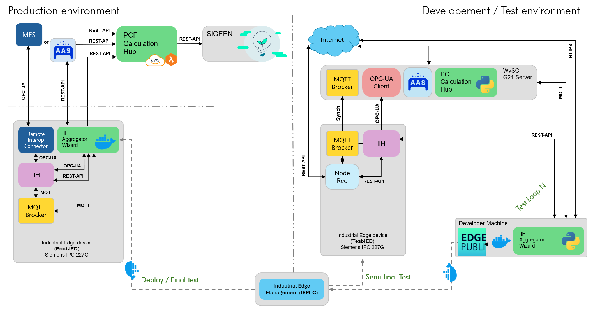

# PCF Calculation Hub (PCF Creator App)

[](https://github.com/a-z-e-r-i-l-a/PCF-Creator-App/actions/workflows/ci.yml)
[](https://codecov.io/github/a-z-e-r-i-l-a/PCF-Calculation-Hub)
[](https://www.python.org/downloads/)
[](LICENSE.txt)

**Proof of concept**

The PCF Calculation Hub is a cloud service that ingests manufacturing consumption and production data, computes product carbon footprint (PCF) reports alongside upstream integrations, and pushes structured reports to SiGREEN where configured. 

Its purpose is not to duplicate shopfloor aggregation. It sits **northbound** of systems that already tie energy to operations—MES pushes, AAS-backed flows, or edge aggregators such as the [IIH Aggregator Wizard](https://github.com/a-z-e-r-i-l-a/IIH_Aggregator_Wizard)—and turns that structured input into bookkeeping, carbon intensity handling, optional material PCF enrichment, and PCF submission workflows.

## Purpose

Product carbon footprinting needs consumption linked to **work orders**, **operations**, and **machines**, plus a clear split between production and non-production energy where factories track it. This hub provides the **calculation and persistence layer**: REST endpoints for consumption and production events, with optional S3 for cloud deployments, SiGREEN-facing PCF reporting, and a browser-based configuration UI.

The app follows common Factory-X and Catena-X / shopfloor patterns:

| Scenario | Production context | Role of this hub |
|----------|-------------------|------------------|
| **MES-driven manufacturing** | A Manufacturing Execution System (e.g. Opcenter) orchestrates orders; MES or middleware POSTs consumption and production payloads. | Stores operations and materials per work order, applies carbon intensity strategy, allocates idle energy when general consumption data is supplied, submits PCF to SiGREEN when enabled. |
| **No-MES (AAS-driven) manufacturing** | Work orders and Bill of Process live in Asset Administration Shells (e.g. AssetFox, BaSyx). | Polls or processes AAS-backed shells according to configuration, aligns with the same bookkeeping and PCF pipelines as the MES path. |

Upstream systems (including IIH-backed aggregators) are responsible for **state-aware aggregation** and interval accounting; this service consumes their **outputs**  and does not query IIH or ring buffers directly.

## Core capabilities

- **REST ingestion** – `POST /consumptionData` and `POST /productionResults` for operation-level energy and materials; `POST /idle_consumptions` for building/machine idle and production energy totals merged into a factory JSON store.
- **Carbon logic** – Configurable carbon intensity mechanisms, compressed-air handling, and material PCF lookup where SiGREEN credentials are configured.
- **Bookkeeping** – Beta version using a Per–work-order JSON database (`data_base.json`) with compatibility for newer multi–energy-type operation structures.
- **PCF reporting** – Builds and submits PCF-oriented reports to SiGREEN.
- **Configuration UI** – Session-protected `/config` for data source, SiGREEN, AAS, and related settings; in-browser docs at `/docs`.
- **Identity (cloud-oriented)** – Microsoft Entra ID sign-in with an administrator-managed allowlist (`allowed_users.json`, optional S3 mirror); optional legacy username/password for bootstrap or break-glass scenarios.
- **Deployment options** – Ideally serverless handler via Mangum on Lambda or single listener on **8443** locally and on EC2 (TLS when cert/key files exist, else HTTP on the same port).

## Quick guide

### Run locally (developer workstation)

1. **Python 3.11+** and a virtual environment: `python -m venv .venv`, then activate (Windows: `.venv\Scripts\activate`).
2. **Install dependencies:** `pip install -r requirements.txt`.
3. **Environment:** copy `.env.example` → `.env` and adjust ports, secrets, and optional Entra/S3 variables.
4. **Start the API:** from the repo root, `python -m app.main` listens **only on `PORT_HTTPS` (default 8443)**. If `SSL_CERTFILE` and `SSL_KEYFILE` resolve to existing files, traffic is **HTTPS**; otherwise the same port serves **plain HTTP** (a warning is logged—use certs in production).
or:
Place `cert.pem` and `key.pem` in the project root or set `SSL_CERTFILE` / `SSL_KEYFILE` in `.env`. If files are missing, `python -m app.main` still binds **8443** but serves **plain HTTP** (not TLS).
### Single-port Uvicorn (HTTPS)
```bash
python -m uvicorn app.main:app --host 0.0.0.0 --port 8443 --reload --ssl-certfile cert.pem --ssl-keyfile key.pem

5. **Open** `https://localhost:8443/docs` (Swagger) when using TLS, or `http://localhost:8443/docs` if you start without certs; use `/login` then `/config` for the settings UI. Basic-auth–protected JSON view: `/data_base_view`.

Sample request bodies for manual calls live in [`tests/fixtures/http_payloads.py`](tests/fixtures/http_payloads.py).

### Deploy (outline)

- **AWS Lambda:** `handler = Mangum(app)` in [`app/main.py`](app/main.py); SAM template and parameters as in the deployment section below; use S3 keys for database and app config so state survives redeploys.
- **EC2:** Gunicorn + Uvicorn workers via [`deploy/gunicorn_conf.py`](deploy/gunicorn_conf.py); load `.env` (or systemd `EnvironmentFile`) for ports and TLS paths.
---

# Architecture 

## Architecture
 The below diagram illustrates a schematic of connections when running the app in developement environment (**--deven** flag) or after deployment in Industrial edge. 



## Configuration UI and authentication

| Route | Purpose |
|-------|---------|
| `/login` | Sign-in. **Microsoft Entra ID** when `MICROSOFT_ENTRA_TENANT_ID`, `MICROSOFT_ENTRA_CLIENT_ID`, `MICROSOFT_ENTRA_CLIENT_SECRET`, and `PUBLIC_BASE_URL` are set; allowlist in `allowed_users.json` (and optional `ENTRA_BOOTSTRAP_ADMIN_EMAILS`). **Legacy** username/password matches basic auth env vars when `ENABLE_LEGACY_PASSWORD_LOGIN=true`. |
| `/config` | Session-protected dashboard: SiGREEN, AAS/MES-style settings, **Users** tab (admins) for Entra allowlist. |
| `/docs`, `/redoc` | OpenAPI UIs |

Session cookies guard `/config` and related APIs; see **Security concept** below.

---

## Testing and configuration

Configuration is **environment-first** (`.env` / Lambda parameters): database paths, S3 buckets for durable JSON, SiGREEN and AAS settings, Entra redirect base URL, session secrets, and basic auth for `/data_base_view`.

### Test tiers

CI runs **unit + simulation** tests with coverage. **Integration** tests target a **running** instances of aggregation layer, MES, or an AAS server. 

| Tier | What you prove | Where it runs | Primary inputs |
|------|----------------|---------------|----------------|
| **1. Unit** | Domain and services, router contracts, mocks; no live HTTP stack | Developer PC | `pytest tests/unit` |
| **2. Simulation** | Full FastAPI app via `TestClient`; externals mocked; temp JSON DB | Developer PC | `pytest tests/simulation -m simulation` |
| **3. Integration** | Real HTTP to a running app | Developer PC → local or deployed URL | `LIVE_BASE_URL`, `pytest tests/integration -m integration` |
| **4. CI** | Unit + simulation combined coverage | GitHub Actions | `.github/workflows/ci.yml`, Codecov |

**Examples**

```bash
python -m pytest tests/unit -q
python -m pytest tests/simulation -m simulation -v
python -m pytest tests/unit tests/simulation -q --cov=app --cov-config=.coveragerc --cov-report=term-missing
```

Integration (with app running, e.g. HTTPS on 8443):

```bash
# Windows PowerShell
$env:LIVE_BASE_URL = "https://localhost:8443"; python -m pytest tests/integration -m integration -v

# macOS / Linux
LIVE_BASE_URL=https://localhost:8443 python -m pytest tests/integration -m integration -v
```


---

## Standards and interoperability

Aligned with common industrial and sustainability integration patterns:

- REST/JSON for MES and middleware consumption and production events.
- Asset Administration Shell usage via the project’s AAS client (registry URL, credentials, and asset naming from configuration).
- SiGREEN REST and OAuth2-style token flows for PCF submission and material lookup.
- UTC / ISO 8601 for timestamps where exposed in APIs and stored payloads.
- PCF-oriented workflows consistent with **Factory-X / Catena-X–style** traceability: structured operational data before downstream PCF reporting.


---

## AWS Lambda + API Gateway (Mangum)

`handler = Mangum(app)` in [`app/main.py`](app/main.py).

### SAM (recommended)

1. Install [AWS SAM CLI](https://docs.aws.amazon.com/serverless-application-model/latest/developerguide/install-sam-cli.html) and configure `aws configure`.
2. `sam build --use-container` (or `sam build` if Python matches the template runtime).
3. `sam deploy --guided` – set stack, region, and parameters (e.g. `BasicAuthUsername` / `BasicAuthPassword` for legacy login; Entra env vars if using Microsoft sign-in).
4. Use stack output **ApiUrl** as base for `/docs`, `/consumptionData`, `/productionResults`, `/login`, etc.

**Login / Lambda env:** Confirm **`BASIC_AUTH_USERNAME`** and **`BASIC_AUTH_PASSWORD`** (or Entra vars) in Lambda **Configuration → Environment variables** if password login misbehaves after deploy.

**Persistence:** The SAM template uses `/tmp` for local JSON files and S3 for durability (`DATABASE_S3_*`, `FACTORY_DATABASE_S3_*`, `APP_CONFIG_S3_*`, `ALLOWED_USERS_S3_*`). If you deploy without SAM, set matching `*_PATH` under `/tmp` and the same S3 variables so state survives cold starts and redeploys.

**Logs:** Stdout/stderr → CloudWatch; the config UI log panel is in-memory only.

### Manual Lambda packaging

Package handler `app.main.handler` with dependencies for the chosen Python runtime; wire HTTP API `{proxy+}` to the function; mirror `.env` as Lambda environment variables.

---

## Microsoft Entra ID (sign-in)

Register a **Web** application in Entra; redirect URI must match:

`{PUBLIC_BASE_URL}{/stage when not local}/api/auth/microsoft/callback`

Example local: `https://localhost:8443/api/auth/microsoft/callback` (must match `PUBLIC_BASE_URL` and how you actually open the app). See [`.env.example`](.env.example) for `MICROSOFT_ENTRA_*`, `ENTRA_BOOTSTRAP_ADMIN_EMAILS`, `ALLOWED_USERS_*`, `ENABLE_LEGACY_PASSWORD_LOGIN`.

---

## CI/CD (GitHub Actions)

[`.github/workflows/ci.yml`](.github/workflows/ci.yml) runs on `main` pushes/PRs: Python 3.11, `pip install -r requirements.txt`, pytest with coverage, Codecov upload. Extend with deploy steps when ready.

---

## License

See [COPYRIGHT.md](COPYRIGHT.md) and [LICENSE.txt](LICENSE.txt).
